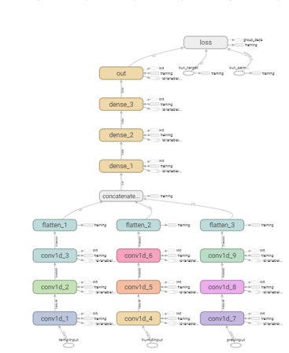
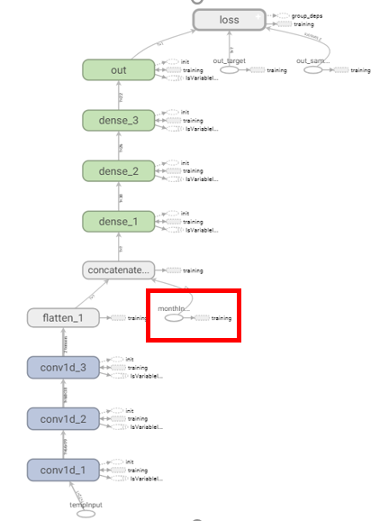

# Temperature Prediction Using NN and Xgb

## 1. Objective
We wish to predict future temperature (every hour) using past weather data.

## 2. Getting Data
We crawled our training data from [CWB Observation Data Inquire System](https://e-service.cwb.gov.tw/HistoryDataQuery/index.jsp?fbclid=IwAR03ffdzMn6oSFDsNSeT34qiOHi5ut4rmW3rIriom7PJGXeFaSqE5I9MyZg). Crawler is at `nn/data/crawler.py`, just call `crawl()` to get csv file of hour-wise weather data between given date interval. For instance:
```python
crawl((1010, 1, 1), (2018, 12, 31))
```

## 3. Processing Data
Data preprocessing for NN are in `nn/data/dataGen.py`. For instance:
```python
x, y = genXY(path, feature, inputDim, nDaysAfter)
```
reads the csv file you crawed and returns numpy arrays that can be directly used for model input and output, where `path` is the path of the csv, `inputDim` specifies how many hours of temperature you want to input, and `nDaysAfter` specifies that y should be the temperature n days after the latest input hour.

Other functions are used for different input format, depending on which model you want to use. For instance `genXYwithMon()` gives you not only temperature input, but also month feature.

For Xgb, data preprocessing is in `xgboost/get_data.py`. Use
```python
from_2010(path, tag, train_hour, max_train_hour, pred_hour)
```
to get raw feature e.g. temperature. Tag is the column in number.
```python
get_time(path, max_hour, pred_hour)
```
to return date and time been normalized by 0~1, date is divided by 366, time is devided by 24.


## 4. Models
In `nn/`, each .py file defines a model:
* **CNNmodel:** Basic CNN with no pooling.

* **CNNsep:** Contains two experimental models: sepCNN() and concatInputCNN()

* **CNNwithMonth:** Temperature data pass through Conv layers, then concat with circularly encoded month feature

* **LSTMmodel:** Just a simple LSTM model

* **TrivialModel:** This model just outputs the last x value. Just for comparison with other models.

* **World** and **ModelGenerator:** Just for fun. Randomly generates models and evolve each generation.

|**CNNsep** (seperate each type of feature)|**CNNwithMonth**|
|-------|---------|
|||

Models are defined in functions. Once the function is called, it immediately starts to fit. Note that, after training is done, some return the trained model, but some only return loss history of the model. This is because some uses **ModelCheckpoint** and **EarlyStopping** to save the best model to `nn/models/`, preventing from getting overfit models. In this case, use `load_model(path)` to get the trained model.

For xgb, in `xgboost/`:
* **train.py** to train model. The feature may be raw or been normalized
	
* **train_cross.py** to do cross validation and testing for each year
	
* **train_PCA.py** the feature been PCAed

* **tuning.py** to tune parameters with raw feature or normalized

* **tuning_PCA.py** to tune parameters with PCAed feature

## 5. Results
We use mean-absolute-error (unit: degree celcius) as a metric to evaluate goodness of a model. Let's see how well they perfrom:

|Model|mae|
|---|---|
|**TrivialModel**|1.92|
|**CNN**|1.398|
|**CNNwithMonth**|1.35|
|**CNNsep**|1.444|
|**LSTM**|1.414|

We tried feeding additional weather feature to improve accuracy, such as pressure and humidity (CNNsep). But turns out past temperature is still the most dominent feature. However, we found that adding month as feature slightly improved our result (CNNwithMonth).

Also, we found that our model performs particularly bad between winter and spring. As the plot below shows, error in the first few months are relatively high.    


  
  
  
  
  
  
  
